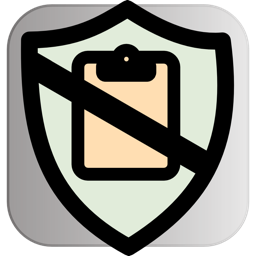

# ClipShield

**ClipShield** is a macOS utility that monitors your clipboard to help prevent accidental data leaks. Inspired by modern privacy needs and built with a minimal, icon-based interface, ClipShield quietly watches your clipboard and flags or redacts potentially unsafe content.

It’s especially useful for developers working with LLMs like ChatGPT, who often paste code and config files containing passwords, API keys, or other sensitive information.

## ✨ Features

- 🔐 Detects and redacts sensitive data using configurable regular expressions (e.g., access tokens, credentials, private keys).
- 📎 Only inspects only clipboard text (for now).
- 🛡️ Provides visual feedback when potentially unsafe content is detected.

## ⚠️ Non-Features

ClipShield:
*	❌ Does not currently inspect files
*	❌ Does not intercept drag-and-drop actions
*	❌ Does not monitor file selection dialogs
*	❌ Is not a comprehensive solution for preventing leaks of API keys, passwords, or other secrets

ClipShield only analyzes clipboard text, using configurable regular expressions. You can add your own patterns, but false negatives are possible—and coverage depends on your use case.

## 🧪 Current status

ClipShield is actively under development as of June 2025. The current release includes:

- Clipboard text redaction with an optional “Unredact” button in the system notification.
- A minimal settings UI with support for editable redaction rules and substitution text.

Support for file-based clipboard entries (e.g. Finder file copies) is planned.

## 🔧 Installation

Currently requires Xcode and macOS **Sequoia** (macOS 15).

Clone and build manually for now:

```bash
git clone https://github.com/cmore-zz/clipshield.git
cd clipshield
open ClipShield.xcodeproj
```

## 📄 License

MIT License. See [LICENSE](LICENSE).
